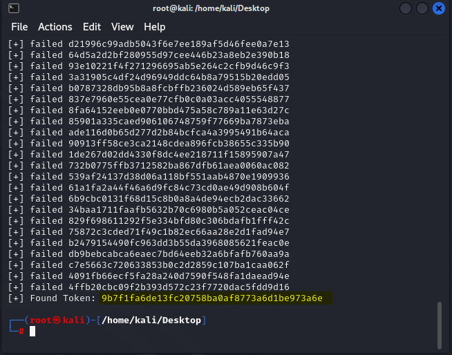
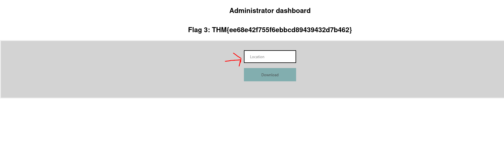
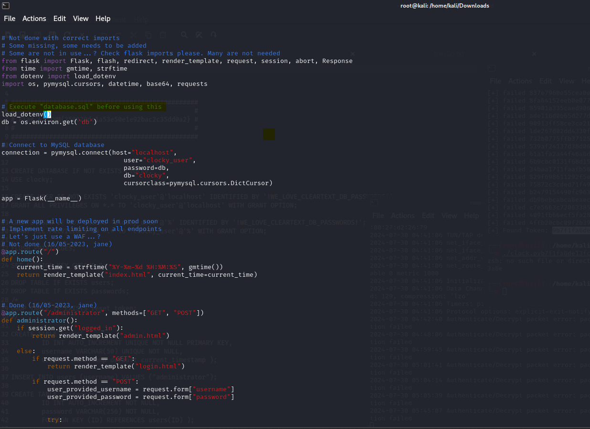

TRYHACKME WALKTHROUGH
-------------------------

->machine name: CLOCKY

->difficulty: MEDIUM

->category: WEB-SERVER

first we scan the target machine using NMAP

-> nmap -sV -sC -A -T4 $ip 

->the result gotten after the scan:

OPEN PORTS
----------
->[80]->http 

->[22]->ssh

->[8080]->http-proxy

->[8000]-> http

as you can see 'http" service is open. less try to check the website hosted.

nothing interesting found on the website i would say. but let's find out if it has robots file:

run -> http://$ip:8000/robots.txt
 
 

 and BINGO!🥳.
 
 let's also check if there are other interesting directories using dirbuster

 -> gobuster dir -u http://$ip:8000 -w /usr/share/dirbuster/wordlists/directory-list-2.3-medium.txt -t 50 

after some directory scrapping through, i got across an interesting directory: 

after accessing, it automatically downloads itself. it appears to be a zipped file. i unzip it and it contains two files:

1. app.py
2. flag2.txt

by using,

-> cat flag2.txt

we have found our flag 2 ladies and gentlemen!

now onto flag 3 hunt!

let's dive into the "app.py script" to see if we can get something interesting.

when navigating through the file, i saw some directory paths like:

1. /administrator
2. /password_reset
3. /forgot_password

and usernames like:

1. jane

2. clarice

3. clocky_user

on the /forgot_password, you input the username and there is a token generated that validates the username can reset the passord(line 96-98).

so let's generate the token by ourselves. i've wrote a script that can help us generate the token.
-> [text](clock.py)

once run, give it a minute to provide the real token generated.

here is the token generated.

in order to have access to our admin platform, we must reset  the admin password from [/reset_password] along with the token provided.

-> http://ip/reset_password?token=[token generated]

after that you reset the admin password.

once successful you can go back to dashboard and enter "administrator' as username and the password you just reset.

and here is flag 3!!!!

the location provided means that now we are in the webserver "paste the path you want to retrieve resources from". and i remember we have a database. maybe it can lead us to something great. 

-> 

since we are on the webserver, it means that we can use "locahost".

so let's try:

-> http://localhost/

ERROR!  it says "action not permitted". basically This response is often associated with HTTP status codes like 403 (Forbidden), indicating that the server understands the request but refuses to authorize it.

so let's play around it and see if we can obtain something.

let's try to specify the database file which we've seen in the 'app.py' file.

-> http://localhost/database.sql

after clicking download, there appears to be a download file. and it contains "flag 4"

We can see that it is a script used to create some tables and there appears to be a password located in the file. we'll try to bruteforce it against the usernames seen above.

first of all, gather the usernames in a file and copy the password from the  'app.py' file. 

let's use a tool called hydra to obtain ssh credentials.

run -> hydra -L usernames.txt -p "<passwordfromfile>" ssh://<ip>

the result got:

now that we confirmed that username "clarice" and password "passwordfromfile" can be used to login to ssh, let's try and see.

by listing the files and folders we can see that there is a file called "flag5.txt" and that's where our flag is located.

by listing hidden files and directories, we see that there is a file called '.env'. this file is very important as it normally has some credential information about mysql service running.

and as expected it  has dbpassword.

now try to login to mysql server

-> mysql -u clock_user -p <passwordgot>

now that we have successfully logged in, run these commands also:

->show databases;
->use mysql;
->select * from  user;

as you can see it looks like it is gibberish.

in order to better understand it, use the following command:

-> SELECT `user`, CONCAT('$mysql', LEFT(authentication_string, 6), '*', INSERT(HEX(SUBSTR(authentication_string, 8)), 41, 0, '*')) AS hash 
FROM mysql.user 
WHERE plugin = 'caching_sha2_password' 
AND authentication_string NOT LIKE '%INVALIDSALTANDPASSWORD%' 
AND authentication_string != '';

this will help to make hashes more comprehensible and easy to understand.

Now we need to copy each hash and provide the same to hashcat tool to crack them using the following command:

->[hashcat -m 7401 -a 0 hash.txt /usr/share/wordlists/rockyou.txt -O –session hash.txt]

Here the hash mode is MySQL SHA256 hash. After a few minutes, we will find that one of the provided hash is cracked and we can see the clear text password using the following command:

->hashcat -m 7401 –show hash.txt

now that we have password for root,  we will login.

i will let you find flag 6 on your own 🤣.

Conclusion: the purpose of this room was to look at ways to compromise a linux webserver using different tools like hydra, hashcat, nmap and gobuster among others.

there is also an interesting concept learn. which is "tokenization".

